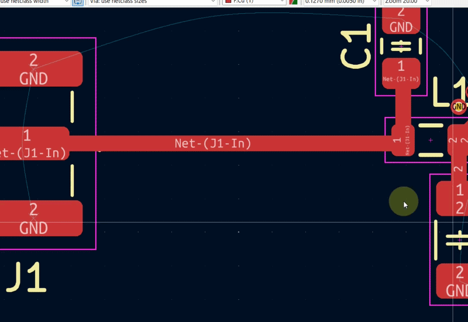

#  ViaFence for KiCad 9 and 10

**ViaFence** is a KiCad 9 and KiCad 10 Action Plugin that places via fences along selected tracks, arcs, and selected footprint pads for EMI shielding, RF grounding, and improved return-current control.

The plugin can follow complex selected copper geometry, including continuous tracks, arcs, T-junctions, multiple branches, and closed loops. It can also create via rings around selected pads.

---

## Demo 1.0.2

 


## Demo 1.0.1



---

## Features

- Places via fences along selected PCB tracks and arcs
- Places via rings around selected pads or pads inside selected footprints
- Supports KiCad 9 and KiCad 10 through the Python/SWIG API
- Works with:
  - straight tracks
  - arcs
  - T-junctions
  - multiple branches
  - closed loops
  - selected pads
- Dual-side or staggered via placement for tracks and arcs
- Optional corner-via placement outside detected bends
- Separate via spacing for tracks and pads
- Selectable target net, usually `GND`
- Configurable:
  - via spacing for tracks
  - via spacing for pads
  - track/pad-to-via gap
  - via diameter
  - drill size
  - end margin
  - corner angle threshold
- Collision checking against:
  - existing tracks
  - arcs
  - vias
  - newly generated vias
  - footprint pads
- Grid-based collision index for better performance on larger boards
- Groups generated vias as `ViaFence (<net>)`
- Stores settings in `via_fence_cfg.json`
- Measurement unit selection: `mm` / `mils`
- Automatic value conversion when switching units
- Restores the last dialog position
- Optional execution statistics

---

## Requirements

- KiCad 9.0 or KiCad 10.0
- Python 3.9 or newer
- wxPython, included with KiCad's Python environment

---

## Installation

Download the latest release from the **Releases** section.

Do **not** use GitHub's generic **Download ZIP** button, because it may not contain the packaged plugin structure expected by KiCad.

Copy the plugin folder from the release archive into your KiCad third-party plugins directory.

Typical Windows paths:

```text
C:\Users\<User>\Documents\KiCad\9.0\3rdparty\plugins
C:\Users\<User>\Documents\KiCad\10.0\3rdparty\plugins
```

The plugin folder should contain:

```text
via_fence/
├── __init__.py
├── via_fence.py
├── via_fence_cfg.json
└── via_fence_icon.png
```

Then restart KiCad or reload plugins from PCB Editor.

---

## Usage

1. Open your board in KiCad PCB Editor.
2. Select one or more tracks/arcs and/or pads.
3. Run **ViaFence** from the plugin toolbar or from the Action Plugins menu.
4. Configure the parameters.
5. Select the target net, usually `GND`.
6. Press **OK**.

The plugin will place vias along the selected geometry and group all generated vias into a KiCad group named:

```text
ViaFence (<net>)
```

Example:

```text
ViaFence (GND)
```

---

## What Can Be Selected

### Tracks and Arcs

Select one or more copper tracks/arcs. ViaFence reconstructs the selected copper as a graph and places vias along the resulting paths.

Supported track/arc cases include:

- single straight segment
- connected multi-segment routes
- arcs
- T-junctions
- multiple branches
- closed loops

### Pads

Select pads directly, or select a footprint if your KiCad build reports its pads as selected.

ViaFence can create via rings around selected pads. Circular pads use a radial ring algorithm. Other common pad shapes use a polygon-outline offset algorithm so that vias follow the real pad outline more accurately.

Supported pad shapes include common KiCad pad types such as circular, oval, rectangular, rounded-rectangle, trapezoid, chamfered-rectangle, and custom pads where KiCad exposes the effective polygon.

---

## Parameters

| Parameter | Description |
|---|---|
| Via spacing track | Distance between regular via positions along selected tracks/arcs |
| Via spacing pads | Distance between via positions around selected pads |
| Track to via gap | Minimum gap from the copper edge to the generated via edge |
| Via diameter | Outer diameter of the generated via |
| Via drill | Drill size of the generated via |
| End margin | Distance from the beginning/end of each track path before placing regular vias |
| Net | Electrical net assigned to generated vias |
| Units | Dialog units: `mm` or `mils` |
| Staggered pattern | Places one via per position, alternating left/right along tracks/arcs |
| Place vias at corners | Adds extra vias outside detected bends when possible |
| Min corner angle | Minimum bend/deviation angle used to detect corners |
| Show statistics | Shows a result summary after placement |

---

## Track and Arc Placement

For tracks and arcs, ViaFence places vias on both sides of the selected copper by default.

The via center offset is calculated from:

```text
track half-width + via radius + Track to via gap
```

When **Staggered pattern** is enabled, the plugin places one via per spacing position and alternates the side. This can be useful when a dense dual-side fence is not needed or when board space is limited.

---

## Pad Ring Placement

When pads are selected, ViaFence places vias around the selected pad outline.

For pad rings, the via center offset is calculated from:

```text
pad edge + via radius + Track to via gap
```

`Via spacing pads` controls the spacing around pads independently from the track/arc spacing.

Pad-ring vias are created before regular track/arc vias. This allows later track/arc candidates to detect the newly created pad-ring vias as obstacles and keep proper clearance.

---

## Notes About Corner Vias

The corner option does not change the main via fence pattern. It only tries to add extra vias outside detected bends.

A corner via may not appear if:

- a regular via is already close to the corner
- the area near the corner violates clearance rules
- another via, track, arc, or pad blocks placement
- the detected bend does not exceed the configured minimum corner angle
- the spacing is small enough that the difference is visually hard to notice

For a visible corner-via test, use a simple 90° track bend with larger spacing, for example 2–3 mm.

---

## T-Junctions and Multiple Branches

ViaFence reconstructs selected copper as a graph. Junction nodes and branch endpoints are used to split the selection into independent paths. This allows the plugin to process shapes such as:

```text
     |
-----+-----
     |
```

Each branch is processed separately while still sharing the same generated via group and collision index.

---

## Collision Handling

Before placing a via, the plugin checks nearby board objects using a spatial grid index. This avoids scanning the whole board for every candidate via and improves performance on larger boards.

Objects checked include:

- tracks
- arcs
- existing vias
- newly created vias
- footprint pads

If placement would violate clearance, the candidate via is skipped.

---

## Configuration File

The plugin saves the last used settings in:

```text
via_fence_cfg.json
```

Example:

```json
{
  "spacing_mm": 1.0,
  "track_spacing_mm": 1.0,
  "pad_spacing_mm": 1.0,
  "track_to_via_gap_mm": 0.25,
  "via_diameter_mm": 0.6,
  "via_drill_mm": 0.3,
  "end_margin_mm": 0.5,
  "staggered": false,
  "net_name": "GND",
  "show_stats": false,
  "place_at_corners": true,
  "corner_angle_deg": 50.0,
  "units": "mm",
  "window_pos_x": 176,
  "window_pos_y": 216
}
```

`spacing_mm` is kept for backward compatibility and represents the track spacing value. `track_spacing_mm` stores the same value explicitly. `pad_spacing_mm` controls spacing around selected pads.

---

## Recommended Starting Values

For general GND stitching around signal traces:

```text
Via spacing track:  0.7–2.0 mm
Via spacing pads:   0.7–2.0 mm
Track to via gap:   0.2–0.4 mm
Via diameter:       0.5–0.7 mm
Via drill:          0.25–0.35 mm
End margin:         0.5–1.0 mm
Net:                GND
```

For RF/high-speed layouts, choose spacing based on the highest relevant frequency and your PCB stackup rules.

---

## Limitations

- The plugin does not automatically verify RF design correctness.
- Generated vias still need to comply with your manufacturer's DRC and fabrication limits.
- Very dense layouts may skip many candidate vias due to clearance conflicts.
- The plugin works on selected tracks/arcs/pads only; it does not automatically detect and process an entire net.
- Some pad-selection behavior depends on how the current KiCad Python/SWIG build reports selected pads or selected footprints.

---

## Troubleshooting

### No vias were placed

Possible causes:

- no tracks, arcs, or pads were selected
- selected path is too short
- via spacing is too large
- clearance rules block placement
- wrong net was selected
- selected geometry is not valid track/arc/pad geometry
- previous generated vias were not removed and now block new candidates

### Corner option seems to make no difference

This is usually normal. Corner vias are additional candidates only. If a normal via is already close to the bend, or if clearance prevents placement, the visual result may look identical.

### Pad ring is incomplete

Possible causes:

- pad area is too close to other copper
- via spacing is too small for the available area
- generated vias would collide with existing tracks, arcs, vias, or pads
- the pad shape is custom and KiCad did not expose a usable polygon outline

### Plugin does not appear in KiCad

Check that the plugin folder contains `__init__.py`, `via_fence.py`, and `via_fence_icon.png`, then restart KiCad or reload plugins from PCB Editor.

---

## License

GPL-3.0
